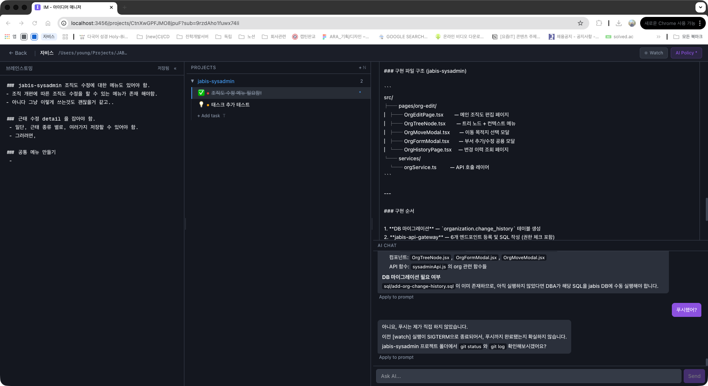

# IM (Idea Manager)

> 아이디어에서 실행 가능한 프롬프트까지, 멀티 프로젝트 워크플로우 매니저

여러 프로젝트를 동시에 진행하는 개발자를 위한 태스크 관리 도구입니다. 아이디어를 서브 프로젝트와 태스크로 조직화하고, 각 태스크별 프롬프트를 정제하여 Claude Code 등 AI 에이전트에게 전달할 수 있습니다. MCP Server를 내장하고 있어 AI 에이전트가 자율적으로 태스크를 가져가 실행할 수 있습니다.



## 핵심 워크플로우

```
브레인스토밍 → 서브 프로젝트/태스크 조직화 → 프롬프트 정제 → MCP로 AI 실행
```

### 계층 구조

```
프로젝트
├── 서브 프로젝트 A
│   ├── 태스크 1  →  프롬프트
│   ├── 태스크 2  →  프롬프트
│   └── 태스크 3  →  프롬프트
└── 서브 프로젝트 B
    ├── 태스크 4  →  프롬프트
    └── 태스크 5  →  프롬프트
```

### 태스크 상태 흐름

```
💡 Idea → ✏️ Writing → 🚀 Submitted → 🧪 Testing → ✅ Done
                                                      🔴 Problem
```

## 설치

```bash
npm install -g idea-manager
```

## 사용법

### 웹 UI 실행

```bash
im start
```

`http://localhost:3456`에서 웹 UI가 열립니다.

```bash
# 포트 변경
im start -p 4000
```

### MCP Server 실행

```bash
im mcp
```

#### Claude Desktop 설정 (claude_desktop_config.json)

```json
{
  "mcpServers": {
    "idea-manager": {
      "command": "npx",
      "args": ["-y", "idea-manager", "mcp"]
    }
  }
}
```

#### Claude Code 설정

```bash
claude mcp add idea-manager -- npx -y idea-manager mcp
```

### MCP 제공 도구

| 도구 | 설명 |
|------|------|
| `list-projects` | 프로젝트 목록 조회 |
| `get-project-context` | 서브 프로젝트 + 태스크 트리 전체 조회 |
| `get-next-task` | 다음 실행할 태스크와 프롬프트 조회 (status=submitted) |
| `get-task-prompt` | 특정 태스크의 프롬프트 조회 |
| `update-status` | 태스크 상태 변경 (idea/writing/submitted/testing/done/problem) |
| `report-completion` | 태스크 완료 보고 |

## 주요 기능

- **탭 기반 멀티 프로젝트** — 브라우저/IDE처럼 여러 프로젝트를 탭으로 동시에 열기, 탭 전환 시 상태 보존
- **3-패널 워크스페이스** — 브레인스토밍 | 프로젝트 트리 | 태스크 상세, 패널 간 드래그로 크기 조절
- **트리형 프로젝트 구조** — 서브 프로젝트 아래 태스크가 계층적으로 표시
- **브레인스토밍 패널** — 자유 형식 메모, 접기/펼치기 가능
- **프롬프트 에디터** — 태스크별 프롬프트 작성/편집/복사, AI 다듬기
- **AI 채팅** — 태스크별 AI 대화로 프롬프트 구체화
- **3탭 대시보드** — 진행 중 / 전체 / 오늘 할 일
- **키보드 단축키** — Ctrl+Tab/Ctrl+Shift+Tab으로 탭 이동, B: 브레인스토밍 토글, N: 서브 프로젝트 추가, T: 태스크 추가, Cmd+1~6: 상태 변경 (한영 전환 상관없이 동작)
- **PWA 지원** — 앱으로 설치하여 독립 창에서 사용 가능
- **Watch 모드** — submitted 태스크를 Claude CLI로 자동 실행, 실시간 진행 표시
- **MCP Server 내장** — AI 에이전트 자율 실행 지원
- **로컬 우선** — SQLite 기반, 데이터는 `~/.idea-manager/`에 저장

## 기술 스택

| 영역 | 기술 |
|------|------|
| Frontend | Next.js 15, React 19, TypeScript, Tailwind CSS 4 |
| Backend | Next.js API Routes |
| Database | SQLite (better-sqlite3) |
| AI | Claude CLI (구독 기반, API 키 불필요) |
| MCP | Model Context Protocol (stdio) |
| CLI | Commander.js |

## 요구 사항

- **Node.js** 18+
- **Claude CLI** — AI 채팅/다듬기 기능 사용 시 필요 (Claude 구독 필요). 없어도 태스크 관리, 프롬프트 작성 등 기본 기능은 정상 동작합니다.

## 라이선스

MIT
