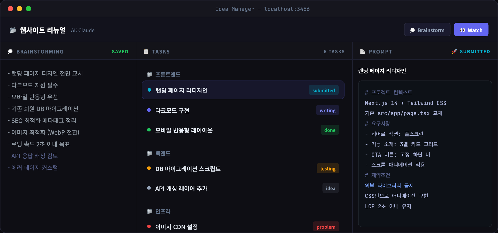

# IM (Idea Manager)

[](https://safeskill.dev/scan/navskh-im)
**English** | [한국어](README.ko.md) | [日本語](README.ja.md) | [中文](README.zh.md)

> **v1.8+ users**: `im start` now auto-updates on boot. If you're on an older version, run `npm install -g idea-manager@latest` once — after that, every future release is applied automatically.

> Turn free-form brainstorming into structured task trees with AI-generated prompts.

A local-first task management tool for developers. Organize ideas into workspaces and projects, refine prompts for each task, and hand them off to AI agents. Built-in MCP Server enables autonomous AI agent execution. Cross-PC sync via Git.



## Quick Start

```bash
npm install -g idea-manager
im start
```

Opens a native-like app window (Chrome/Edge `--app` mode). First run builds automatically. From v1.8.0, `im start` checks npm on boot and auto-upgrades when a newer version is available (`IM_NO_AUTO_UPDATE=1` to opt out).

## Core Workflow

```
Brainstorming → Projects / Tasks → Prompts → AI Agent Execution
```

### Hierarchy

```
Workspace
├── Project A
│   ├── Task 1  →  Prompt
│   ├── Task 2  →  Prompt
│   └── Task 3  →  Prompt
└── Project B
    ├── Task 4  →  Prompt
    └── Task 5  →  Prompt
```

### Task Status Flow

```
💡 Idea → 🔥 Doing → ✅ Done
                      🔴 Problem
```

Legacy statuses (`Writing`, `Submitted`, `Testing`) remain available and are shown as a dashed badge on pre-v1.6 tasks.

## CLI Commands

| Command | Description |
|---------|-------------|
| `im start` | Start web UI (port 3456) |
| `im start -p 4000` | Custom port |
| `im mcp` | Start MCP server (stdio) |
| `im watch` | Auto-execute submitted tasks via AI CLI |
| `im sync init` | Initialize cross-PC sync |
| `im sync push` | Export data + push to Git |
| `im sync pull` | Pull + import data |
| `im sync` | Show sync status |

## Features

### Multi-Agent Support

Choose your AI CLI per project:

| Agent | CLI | Description |
|-------|-----|-------------|
| **Claude** | `claude` | Anthropic Claude Code CLI |
| **Gemini** | `gemini` | Google Gemini CLI |
| **Codex** | `codex` | OpenAI Codex CLI |

Select from the project header dropdown. Used for Watch mode and AI Chat.

### Cross-PC Sync

Sync your data across machines via a private Git repository.

```bash
# First machine
im sync init          # Create/connect a Git repo
im sync push          # Export + push

# Other machines
im sync init          # Same repo URL
im sync pull          # Pull + import
```

Supports auto repo creation with [GitHub CLI](https://cli.github.com) (`gh`).

### MCP Server

Expose tasks to external AI agents via Model Context Protocol.

**Claude Desktop** (`claude_desktop_config.json`):

```json
{
  "mcpServers": {
    "idea-manager": {
      "command": "npx",
      "args": ["-y", "idea-manager", "mcp"]
    }
  }
}
```

**Claude Code**:

```bash
claude mcp add idea-manager -- npx -y idea-manager mcp
```

#### MCP Tools

| Tool | Description |
|------|-------------|
| `list-projects` | List all projects |
| `get-project-context` | Full sub-project + task tree |
| `get-next-task` | Next submitted task to execute |
| `get-task-prompt` | Get prompt for a task |
| `update-status` | Change task status |
| `report-completion` | Report task done |

### Watch Mode

Auto-execute submitted tasks with real-time streaming output:

```bash
im watch                          # All watch-enabled projects
im watch --project <id>           # Specific project
im watch --interval 30 --dry-run  # Preview mode
```

### Note-Centric Editor (v1.6)

The task detail replaces the old separate "description + prompt" pair with a single rich Markdown note.

- **CodeMirror Editor** — Markdown syntax highlighting with distinct styling for headings, list markers (`-`, `1.`), code, links, and quotes. GFM enabled (task checkboxes, strikethrough, tables).
- **⌘K AI Command Palette** — Refine the selection or continue at cursor without leaving the note:
  - 이어서 써줘 (continue) · 이 부분 정리해줘 (tidy) · 할 일로 쪼개줘 (split into tasks) · 질문으로 바꿔줘 (to questions) · 요약해줘 (summarize) · Custom prompt
  - Result is inserted inline. **Cancel** mid-run; **Undo** within 30s of applying.
  - Runs on Sonnet without project context for ~7s typical latency.
- **Context-Aware Autocomplete** — Ghost text suggests multi-word phrases (up to 3 tokens). Corpus pulls from the current note, sibling tasks in the same project, and the project's brainstorm. Phrases sharing vocabulary with the current note are boosted, so related terms surface first. `Tab` accepts, `Esc` dismisses.
- **List Auto-Continue** — Enter continues bullets/numbers/checkboxes; Enter on an empty item exits the list.
- **Copy as Prompt** — One-click copy of the whole note formatted for pasting into Claude Code / another agent.

### Workspace

- **3-Panel Layout** — Brainstorming | Project Tree | Task Detail (drag to resize)
- **Tab-based Navigation** — Multiple projects open simultaneously
- **File Tree Drawer** — Browse linked project directories
- **Brainstorming Panel** — Free-form notes with inline AI memos
- **Auto Distribute** — AI analyzes brainstorming and distributes tasks to sub-projects with preview/edit modal
- **Note Assistant** — Per-task AI chat (formerly "AI Chat") for refining the note, with one-click insert into the note
- **Quick Memo** — Global scratchpad on dashboard for free-form notes (auto-saved)
- **Morning Notifications** — Daily macOS notification at 9 AM with today's tasks summary
- **Dashboard** — Active / All / Today / Archive views
- **Keyboard Shortcuts** — `B` brainstorm, `N` project, `T` task, `⌘K` AI command palette, `⌘1/2/3/4` status (Idea/Doing/Done/Problem)

### Data

- **Local-first** — All data in `~/.idea-manager/data/` (SQLite via sql.js)
- **Zero native deps** — Pure JavaScript, no C++ build tools needed
- **Auto backup** — Database backed up before each sync pull
- **App mode** — Opens in Chrome/Edge without address bar

## Tech Stack

| Area | Technology |
|------|------------|
| Frontend | Next.js 16, React 19, TypeScript, Tailwind CSS 4 |
| Backend | Next.js API Routes |
| Database | SQLite (sql.js, pure JS) |
| AI | Claude / Gemini / Codex CLI |
| MCP | Model Context Protocol (stdio) |
| CLI | Commander.js |

## Requirements

- **Node.js** 18+
- **AI CLI** (optional) — [Claude CLI](https://docs.anthropic.com/en/docs/claude-code), [Gemini CLI](https://github.com/google-gemini/gemini-cli), or [Codex CLI](https://github.com/openai/codex) for AI features. Core task management works without it.

## Troubleshooting

**`im` command not found after install**

Add npm's global bin directory to your PATH:

```bash
# Check the path
npm prefix -g
# Add to shell profile (~/.zshrc or ~/.bashrc)
export PATH="$(npm prefix -g)/bin:$PATH"
```

**Port already in use**

```bash
# Kill the process using the port
lsof -t -i :3456 | xargs kill -9    # macOS/Linux
netstat -ano | findstr :3456          # Windows (then taskkill /PID <pid> /F)
```

## Changelog

### v1.6.0

- **⌘K AI Command Palette** — Inline refine/continue/summarize/split commands, result inserted at cursor. Cancel + 30s Undo. Runs on Sonnet with lean context (~7s vs 90s previously).
- **CodeMirror Note Editor** — Replaces textarea with a full Markdown editor: syntax highlighting, GFM task lists / strikethrough / tables, list auto-continue, ghost-text autocomplete.
- **Context-Aware Autocomplete** — Multi-word phrase suggestions drawn from the current note + sibling tasks + brainstorm. Shared-vocabulary boost surfaces topically related completions first.
- **`doing` status** — Simplified default flow (Idea → Doing → Done). Legacy statuses preserved with a dashed badge.
- **Task archive & tags** — `is_archived` and `tags` columns with Archive dashboard tab.
- **Legacy prompt merge** — Existing `task_prompts` are one-time merged into the note description with a `<!-- legacy-prompt -->` marker.
- **Note Assistant** — Per-task AI chat repositioned around note refinement, with one-click insert.
- Runtime: `RunAgentOptions.model` override, CodeMirror-aware global-shortcut filter.

### v1.3.0

- **Task Archive** — Delete → Archive/Delete choice; archived tasks preserved with prompts and conversations
- **Archive tab** — Dashboard tab to browse, restore, or permanently delete archived tasks
- **DB Sync UI** — Dashboard Sync button with Git push/pull modal (init, push, pull)
- **Gemini model fix** — Switch from gemini-3-flash-preview to gemini-2.5-flash (stable, better rate limits)
- **Claude model upgrade** — Default model changed to Opus
- **Auto Distribute improvements** — Better JSON parsing, error details in modal
- **Chat cwd fix** — AI chat now runs in project's linked directory

### v1.2.0

- **Auto Distribute** — AI-powered brainstorming to task distribution with preview/edit modal
- **Quick Memo** — Global scratchpad on dashboard (auto-saved to DB)
- **Chat state indicators** — Loading/done badges on tasks in project tree (persists until task opened)
- **Chat isolation fix** — Switching tasks no longer mixes AI responses between tasks
- **Morning scheduler** — Daily 9 AM macOS notification with today's tasks summary
- **Gemini JSON parsing** — Fix raw JSON display in Gemini chat responses
- **Resizable description** — Task description textarea is now vertically resizable

### v1.1.7

- Fix: write DB to disk immediately instead of delayed save

## License

MIT
